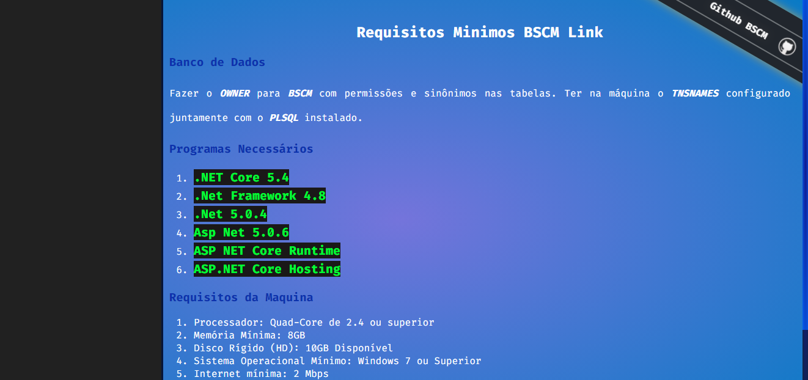

 
  
  &#xa0;
  

  <!-- <a href="https://doc.netlify.com">Demo</a> -->

<h1 align="center">Requisitos Minimos BSCM Link </h1>

  

  

  

  
  
  

  <!--  -->

  <!--  -->

  <!--  -->

<!-- Status -->

<!-- <h4 align="center"> 
	🚧  Doc 🚀 Em construção...  🚧
</h4> 

 -->
## :dart: Sobre ##

Requisitos Minimos BSCM Link 

Feito com :heart: por <a href="https://github.com/Gabriel4420" target="_blank">Gabriel Rodrigues Perez</a>

  
  
  

&#xa0;

<a href="#top">Voltar para o topo</a>
